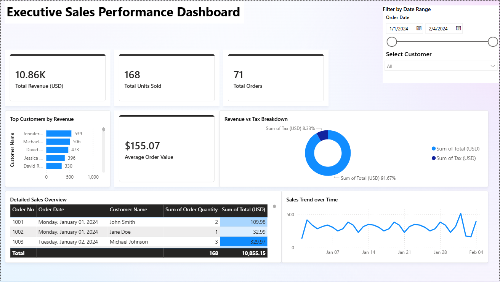

# Executive Sales Performance Dashboard (Power BI)

A dynamic, corporate-grade Power BI dashboard developed to transform raw supermarket transactional data into actionable financial and operational insights for executive decision-making.

## 📊 Live Preview


## 🎯 Key Features & Business Metrics
* **Executive KPI Tracking:** Real-time metrics for Total Revenue, Total Units Sold, and Total Orders.
* **Advanced Financial Analytics:** Developed a custom **DAX Measure** for **Average Order Value (AOV)** formatted to corporate reporting standards.
* **Operational Overheads:** Implemented a **Revenue vs. Tax Breakdown Donut Chart** to evaluate tax margins.
* **Interactive Filtering:** Enabled cross-filtering via a dual-handle **Date Slider** and a searchable **Customer Dropdown Slicer**.
* **Granular Reporting:** Included a detailed sales overview matrix table at the bottom with **Conditional Formatting (Color Gradients)** to instantly spot high-value bulk orders.

## 🛠️ Tech Stack & Skills Demonstrated
* **Tool:** Power BI Desktop
* **Data Modeling & Analytics:** DAX (Data Analysis Expressions), Data Granularity, Cross-Filtering
* **UI/UX Design:** Corporate Alignment, Theme Consistency, Visual Hierarchies, KPI Card Design

## 💡 Custom DAX Formula Used
```text
AOV = DIVIDE(SUM('SuperMarket Sales'[Total (USD)]), COUNT('SuperMarket Sales'[Order No]))
